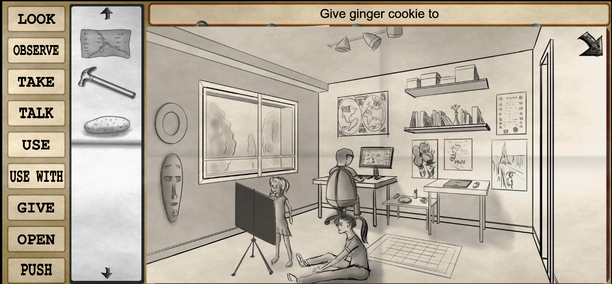
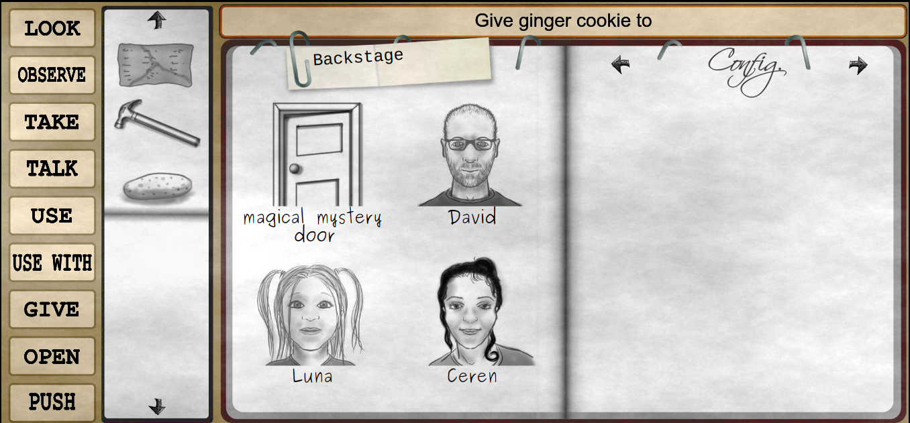

# JSCUMM: A JavaScript engine for web and mobile graphic adventures
The JSCUMM project is an engine to create point-and-click graphic adventures for web and mobile devices.
 
This engine was created as a scripting and GUI framework for the mobile game [Holmes O'Bedlam](https://play.google.com/store/apps/details?id=com.watsonnotes.holmesobedlam). Now the engine is released as an independent open source project.






## Features
- Games are totally HTML5. No server needed, so the game can be served from a web server or distributed as offline games or mobile application.
- Can be used to create mobile applications from the game via tools like [Cordova](https://cordova.apache.org/). 
- Fully customizable GUI. All you need is a SVG editor like [Inkscape](https://inkscape.org/)
- Scripting language based in JSON. Easy to write, easy to debug.
- Classic point-and-click interface, like old-good-times graphic adventures.
- No three headed monkeys were injured or mistreated during the programming of the engine.
- Fully support of translated text and interface.
- Auto-save of the current game and manual saving and loading (all in local storage so no remote servers needed).
- Incorporated tools for extracting texts for translations.
- Easy to debug through the JavaScript console of the web browser.
- Support for showing the picture of the character that is talking and also support for different faces depending on the state of the character (angry, sad, gentle...).


## Getting started
To play a demo of the engine, clone the repository in the root of your local web server:
```
git clone 
```
The tutorial scene will be available at http://localhost

If you do not have a web server installed in your computer, you can launch a docker with a web server either executing:
```
sh launch.sh
```
or directly with the command line:
```
docker run --name jscumm -v $(pwd):/usr/share/nginx/html:ro -p 80:80 -d nginx
```

## Games using the JSCUMM Engine
- [Holmes O'Bedlam](https://play.google.com/store/apps/details?id=com.watsonnotes.holmesobedlam)

## Creating your own games
The JSCUMM engine has been published as an open source project so you can make your own games just focusing in the important part: having fun with the script and the artwork. 

It is intended to be used as it is, if you do not have experience programming, and is fully customizable if you are not afraid of some SVG.

You can find different tutorials and reference guides in the documentation page. 

Also, in the 'chapter' directory you can find some scenes ready to be used with many examples of how to script most (if not all) of the commands and case of use of the JSCUMM scripting language. Also this scenes can be useful as templates or guides about how to create your own scenes and program the behaviour of the characters and objects.

## Contributing
Please read the [CONTRIBUTING](https://github.com/daviddetorres/connection-status-exporter/blob/master/CONTRIBUTING.md) guidelines.

## Credits
- [David de Torres](https://github.com/daviddetorres) - *Initial work*

## License
This project is published under Apache 2.0, see [LICENSE](https://github.com/daviddetorres/connection-status-exporter/blob/master/LICENSE).
