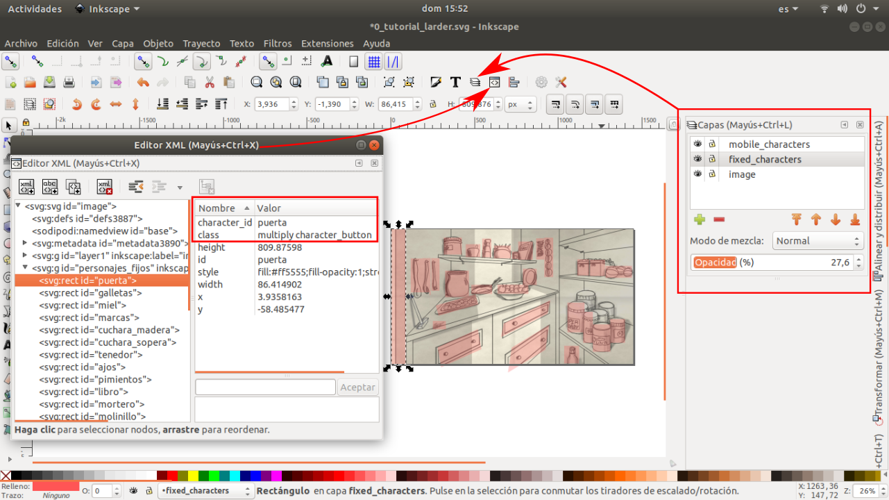

# How to create a new scene

In the [directory of the demo chapter](./../chapter/), there are two fully working scenes that can be inspected and used as templates. 

## Create a JSON configuration file
First of all, a json file of the scene must be created in the '/chapter/scenes' directory. The definition of this file can be found [in this other guide](Configuration_files.md).

## Create a SVG image file
If we want the scene, apart from the notebook behaviour, to have an image that the player can explore with lots of clickable objects, we have to create a svg image for the scene. This svg image will bo configures un the "image" field of the scene configuration file and it will be located in the '/chapter/images' directory. 

This svg file can be created and edited with any svg editor. In this guide we will show how to do it with [Inkscape](https://inkscape.org/).

If you open one of the demo scenes that comes with the engine, you can find something like this: 

First of all, if you are not familiar with Inkscape, lets open the layers menu and the XML editor, as shown in the image. 

This scene is organized in 3 layers:
- One for the background image: The image itself of the scene.
- One for the mobile characters:In this case, here there are the characters or objects that can disappear from the scene, like the hammer.
- One for the fixed characters: All the rest of the areas that, when clicked, actions will be triggered. 

As you can see, in teh image the layer of fixed characters show red squares and areas, but this is just for the tutorial. Normally, this layer will be with opacity:0%, so the areas are not seen for the player.

Now that we can see the clickable objects, let's continue in how to give them life. How can we make that when the player clicks one of these areas in the SVG, an action configured in the JSON file is executed? 

To do so, we have to open the XML editor, select the object and make two things: 
- Add a new field 'class' and give it the value 'character_button'. This will tell the GUI that this area has a character behaviour configured in the JSON file.
- Add a new field 'character_id' and give it the value of the character_id. This will be the same ID used in the field ID of this character in the JSON scene configuration file. 

## Some tips and advises

:pencil2: Pen and paper before keyboard. 

Always write first the script of your game before drawing or coding anything. Use notebooks, post-its, white-boards, graphs... This is the stage to make changes. 

Once you start to code and draw, changing the flow of the game, introducing a new character, a new dialog, a new item to take or to leave can mean hours of work to be remade.

:sunglasses: The default actions are your friends. 

If you have 25 objects in your scene and 10 possible actions, you will need to write the behaviour of 250 possible combinations, not counting in the dative actions (who didn't try to combine all the items in the inventory with all the objects in the scene when blocked in an adventure?). 

Unless you have an army of three headed monkeys ready to program all this code, you can just write some default actions (like: "I don't think it's gonna work.") and put them in a random command, so it gives different feedback and the player does not get bored of the same answer all over his frustration. 

:sunglasses: Remember to use functions all you can to save code.

Even if it is a JSON-based scripting language, it is a programming language after all, so behave yourself and write clean code (the yourself-of-the-future will never thank you enough for this).

With the command goto you can call other actions in the characters of the scene, or even in items. This actions can be the standard ones... or not! 

You can just make a new action in a character and use it with the goto program. You can even make a new character just to hold all these functions! Be creative.

:pencil2: Use the browser for debugging.

Opening the JavaScript console of the web browser you will have access to the live log of the engine. There you will see all the traces and errors that arise. 

Did you misspell the ID of a character? Did you forget to assign the correct class to the character in the SVG? The logs will guide you in your way.

Also, if you need more detail in the logs you can change the log level changing the log.level variable in [the jscumm.js file](../js/jscumm.js). Possible values are INFO, DEBUG and TRACE.

## And last but not least...

Have fun! 

You are writing a videgame, not a XML-based API for a legacy ERP... in Cobol!. Even though, making games can be long, tiring and even frustrating, so at least, have fun writing the scripts. 

Use jokes, irony, references to the games of the 90's (not only three headed monkeys, be more creative than me), break the 4th wall (if Dora the Explorer and Deadpool do it, why not you?)... 

You'll gain mental health and your players will notice it. 
